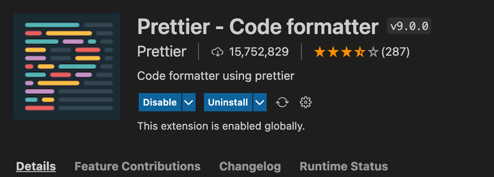
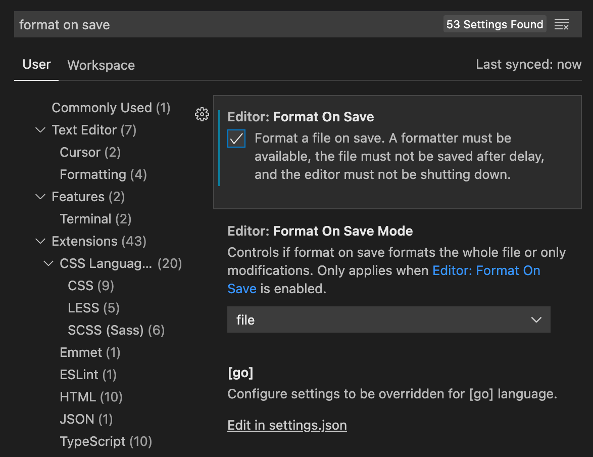

# Installing and configuring Prettier

## Steps to set up and use Prettier

1. Install the package:

```bash
npm install --save-dev --save-exact prettier
```

2. Depending on your code editor install the Prettier Extension
   

3. Activate the format on save (this one is optional)
   

4. Use the commands to check and format code

```bash
npx prettier --check . # checks everything on this directory
npx prettier --write . # formats everything on this directory
npx prettier --write 'core/**/!(*.spec.js)' #formats everything in this directory except the files matching the glob pattern
```

5. Add the optionals Prettier config files

```bash
.prettierignore # put every dir or file that Prettier should ignore
.prettierrc.json # put rules that this specific project should apply
```

[](https://commitizen.github.io/cz-cli/)
